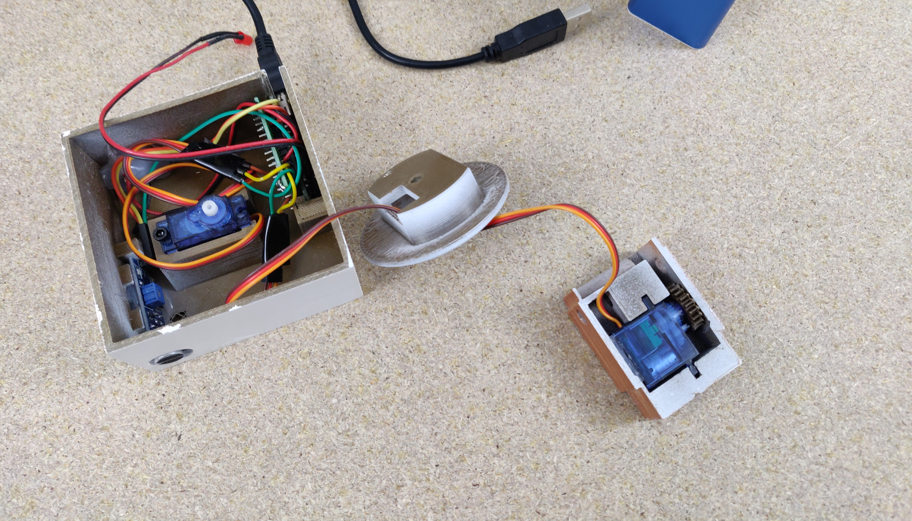

# Golem
Electronics used:
- 1x 3V red LED
- 1x Arduino Nano Microcontroller
- 2x SG90 Servo Motor
- 1x USB to Mini USB Cable

I used the serial connection between the Microcontroller and my PC to control the movement via a Sketch I wrote in Processing

Assembly

